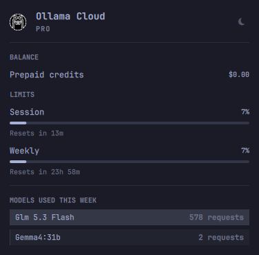

# Ollama Cloud Usage for Omarchy

Real-time usage from your **Ollama Cloud** account, straight in your Omarchy bar: plan tier, 5-hour session and weekly limit meters, extra-usage balance, and which models you actually ran — collected live from ollama.com with a built-in collector. Optionally link your Claude Code, Codex CLI, and Fireworks usage in the same panel.



## Why this plugin

Omarchy's built-in agent widget tracks Claude Code, Codex, and Fireworks — but **not Ollama Cloud**. ollama.com has no usage API, so this plugin ships its own collector that renders `https://ollama.com/settings` with a headless copy of your desktop browser profile and reads the numbers straight off the page: plan tier, "Session usage" and "Weekly usage" (percent used and reset countdowns), the extra-usage balance, and per-model request segments.

**Ollama Cloud is the main provider here.** If you don't use Claude, Codex, or Fireworks, you never see them — they only appear when they have data.

## What you get

| Feature | Ollama Cloud | Claude Code | Codex CLI | Fireworks |
|---|---|---|---|---|
| Plan tier (PRO, etc.) | ✅ | ✅ | ✅ | ✅ |
| Session (5-hour) + weekly limit meters with % used | ✅ | ✅ | ✅ | ✅ |
| Reset countdowns | ✅ | ✅ | ✅ | ✅ |
| Extra-usage balance (prepaid credits) | ✅ | ✅ | — | ✅ |
| Per-model request counts | ✅ | — | — | — |
| Per-model token breakdown (input/output/cache) | — | ✅ | ✅ | ✅ |
| Today + last 7 days token history | — | ✅ | ✅ | ✅ |
| Multi-machine sync (optional) | ✅ | ✅ | ✅ | ✅ |

- **Real-time Ollama Cloud data.** The collector runs on every panel refresh and on a slow 15-minute cadence, since Ollama Cloud usage changes slowly and the render is not cheap. The bar icon lights up when a window passes 90% or your prepaid balance runs low.
- **Per-model requests.** See which models you actually used this week — e.g. `glm 5.3 Flash`, `gemma4:31b` — with request counts, straight from your ollama.com account.
- **Optional extras.** Claude Code, Codex, and Fireworks cards show rate-limit pace, per-model token breakdowns, and a 7-day history chart. Providers without data don't appear at all.
- **Controls.** Click the bar icon to open the panel. Switch providers with a middle-click on the bar icon, the named tabs inside the panel, or the ←/→ arrow keys; ↑/↓ scrolls. The refresh button in the panel header (or the `r` key) re-reads every provider; `Esc` closes. Right-click on the bar icon opens the agent picker.

## Install

```sh
omarchy plugin add https://github.com/GePi0/omarchy-ai-usage.git --enable
```

## Requirements

- **Omarchy** with the AI widget enabled (`omarchy.agents` is on by default; this plugin replaces it in the bar)
- **Ollama Cloud:** a Chromium-based browser — Google Chrome, Chromium, or Brave — **signed in to [ollama.com](https://ollama.com)**. Just open ollama.com once in your desktop browser and make sure you are logged in; the plugin reads the rest.
- **Claude Code / Codex CLI / Fireworks:** needed only for their own optional cards. Providers without data simply don't show up in the panel.

## How it works

The Omarchy shell reads one JSON file per agent from `~/.local/state/omarchy/agents/usage/`, written by collectors behind `omarchy-agent-usage-update`. Collectors for Claude Code, Codex, and Fireworks ship with Omarchy itself; **the Ollama Cloud collector is built into this plugin**.

Providers can be toggled individually without uninstalling — for example, to see only Ollama Cloud:

```sh
omarchy bar set ollama-cloud.ai-usage providers '{"claude":{"enabled":false},"codex":{"enabled":false},"fireworks":{"enabled":false}}' --json
```

If auto-detection picks the wrong browser, force the right one:

```sh
python3 ~/.config/omarchy/plugins/ollama-cloud.ai-usage/collect.py    # print the record as JSON
OLLAMA_USAGE_BROWSER=chromium python3 ~/.config/omarchy/plugins/ollama-cloud.ai-usage/collect.py --write
```

`OLLAMA_USAGE_BROWSER` accepts `google-chrome`, `chromium`, or `brave`; `OLLAMA_USAGE_PROFILE` points at a specific browser profile directory if you have several.

## Uninstall

```sh
omarchy plugin remove ollama-cloud.ai-usage
```

Removal deletes the plugin checkout and drops `~/.local/state/omarchy/agents/usage/ollama.json`, so the Ollama Cloud provider leaves the panel. It does not touch browser profiles, cookies, or sessions.

## Privacy

The collector renders one local page view with your existing browser session — no new logins, no shared data. No cookies, tokens, or page content are ever written anywhere; only the usage numbers land in the local state file. Expired sessions are not refreshed: open ollama.com in your browser and sign in again to renew.

## License

[MIT](LICENSE) — © 2026 Gerard Piella